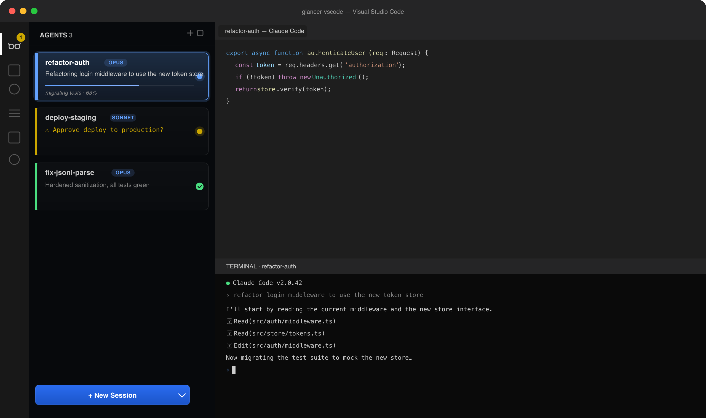
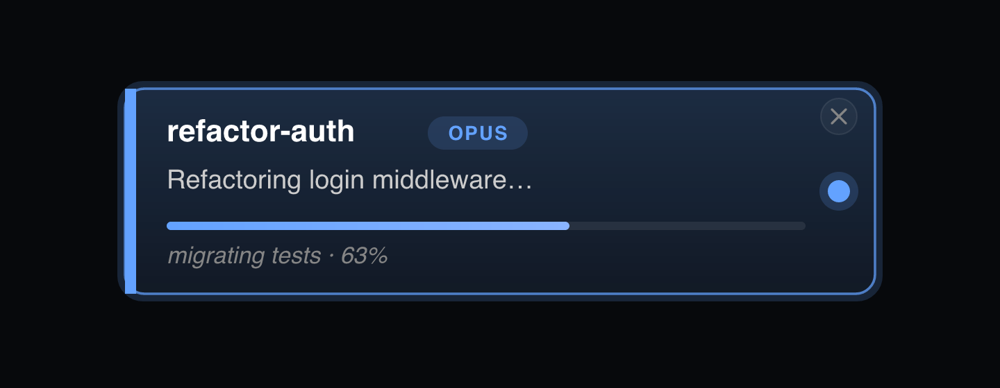
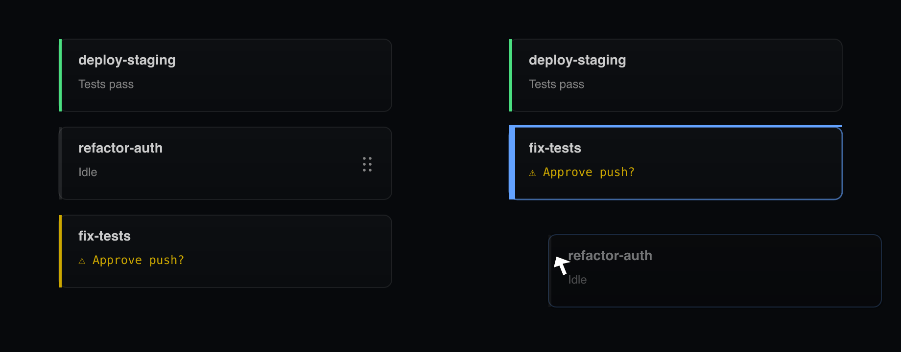
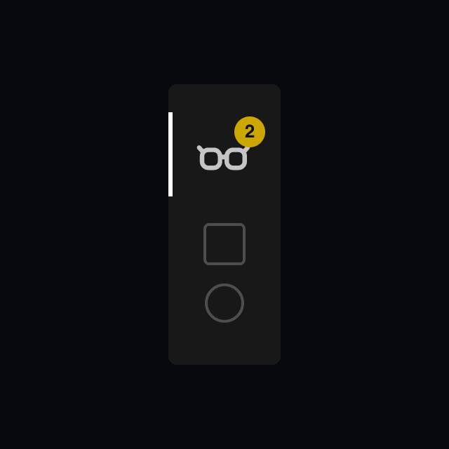

# Glance for Claude Code

by [Hamza Waleed](https://hamzawaleed.com)

Manage multiple Claude Code agents at a glance in VS Code — live status cards for each session, no eye strain switching between terminals.

Every agent runs in a real VS Code terminal. Each one reports its own title, one-line TL;DR, progress, and a flag when it's blocked on you — all on a card in the sidebar — so you can keep five sessions humming without staring at five terminals.

## Install

From the **VS Marketplace**: [hamzawaleed.glance-claude-code](https://marketplace.visualstudio.com/items?itemName=hamzawaleed.glance-claude-code) — or in VS Code, open Extensions and search for **"Glance for Claude Code"**.

Requirements:

- VS Code 1.90+
- Claude Code (`claude` binary on `PATH`)
- A workspace folder open

Click the Glance icon in the activity bar to open the panel, then hit **+ New Session** (or `Cmd+Shift+G` / `Ctrl+Shift+G`).

## What you see

### Status cards driven by Claude itself

Glance ships a tiny MCP server and instructs Claude to call its `update_state` tool at the end of every turn. The tool's JSON payload lights up the card — no transcript parsing, no scraping shell output.

Five fields, sent on every call (pass `null` for what doesn't apply):

| Field | What it does |
| --- | --- |
| `title` | 2–4 word card title. AI sets it on the first turn; you can rename to lock it. |
| `tldr` | One short, speakable sentence summarizing the latest outcome. |
| `progress` | `{ value: 0..1, label: string }` for multi-step work; hidden on trivial turns. |
| `needsInput` | Short clause when the agent is waiting on you. Lights the card yellow. |
| `error` | Short clause when a hard failure blocks progress. Lights the card red. |

The card also tracks lifecycle automatically — turn-complete plays a tone (only when you're not already watching that agent), `/clear` and `/compact` reset the card, and Claude's idle "Notification" pings are ignored mid-stream so they don't false-positive the attention flag.

### Drag to reorder

Hold any card and drop it where you want it. Order persists across reloads.

### Attention badge on the activity bar

When any agent needs input or hits an error, the Glance icon in the activity bar shows a count badge — so you know to come back even when the sidebar is collapsed or you're in another panel.

### Heads-up when a turn finishes in the background

If you're not actively watching an agent when its turn completes, Glance plays a soft tone so the result reaches your ears without yanking focus or stacking a notification panel entry. The activity-bar badge and the card's status pip pick up the visual side — see above.

The tone is suppressed when you're already looking at that agent's terminal, so you don't get pinged for work you're staring at.

### Sessions persist across reloads

Close VS Code, reopen it — your agents are still there. Reload-the-window doesn't kill them either. Cards render from the last known state immediately; clicking one **revives** the session via `claude --resume <sessionId>` only when you focus it, so dormant agents cost nothing.

(Agents you spawned but never prompted aren't persisted, since there's no transcript to resume from.)

### Per-agent model picker

The dropdown chevron next to **+ New Session** lets you choose Opus / Sonnet / Haiku per agent. The card shows a small chip with the active model.

### Pin a card you don't want to lose

Press `p` with a card focused to pin it. Pinned cards jump to the top of the list (FIFO when you pin a second/third), can't be killed with `Cmd+Backspace` or the X (the X is replaced by a pin icon), and survive reloads. Press `p` again (or click the pin icon) to unpin.

## Keyboard shortcuts

The whole point of Glance is that you steer a fleet from one panel — no terminal-tab juggling. Most of the shortcuts only fire while the panel itself is focused (`Cmd+Shift+G` / `Ctrl+Shift+G` gets you there from anywhere).

### From anywhere in VS Code

| Action | Shortcut |
| --- | --- |
| Focus the Glance panel | `Cmd+Shift+G` / `Ctrl+Shift+G` |
| New agent | `Cmd+Alt+N` / `Ctrl+Alt+N` |

### With the Glance panel focused

| Action | Shortcut |
| --- | --- |
| Cycle agents | `↑` / `↓` |
| Jump into the highlighted agent's terminal | `Enter` |
| Drop back to the panel | `Esc` |
| Pin / unpin the highlighted agent | `p` |
| New agent | `g` (or `Cmd+Shift+G` again) |
| Run `/clear` on the highlighted agent | `c` `c` (press `c` twice within 400 ms) |
| Toggle bottom-panel maximize (full-screen the terminal) | `f` |
| Kill the highlighted agent | `Cmd+Backspace` / `Ctrl+Backspace` |

Double-click a card title to rename it. Renames are sticky — AI updates won't overwrite a manual title until you `/clear` the session.

## License

MIT.
